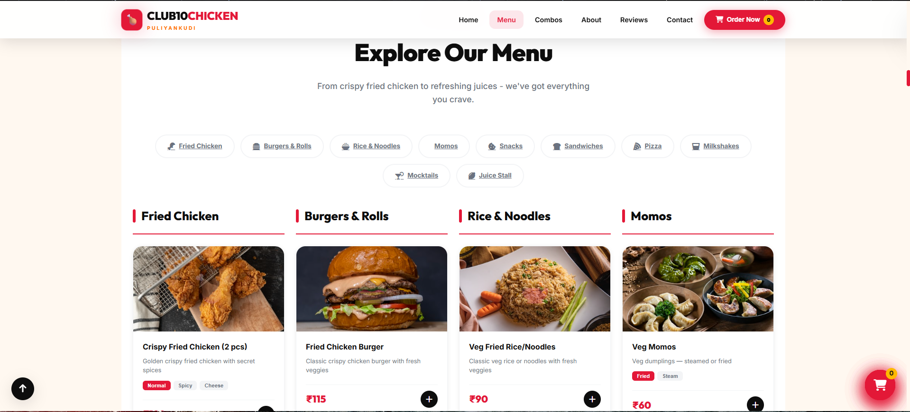
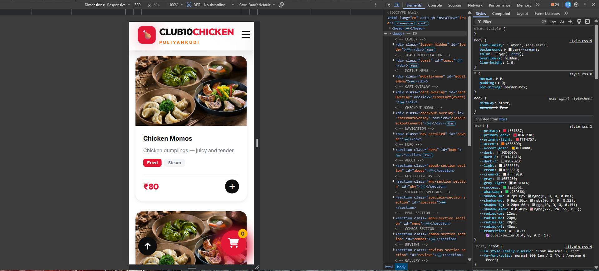

# 🍗 CLUB10CHICKEN - Official Business Website

A modern, responsive business website developed for **CLUB10CHICKEN**, a local chicken restaurant. This project was created to help the business establish an online presence, showcase its menu, and provide customers with an easy way to explore products and place orders.

---

## 📌 Project Overview

CLUB10CHICKEN has been serving customers for over 3 years. This website was developed to:

* Improve online visibility
* Showcase menu items and combo offers
* Display customer reviews
* Enable quick ordering through WhatsApp
* Provide business contact information
* Deliver a smooth user experience across all devices

---

## ✨ Features

### 🏠 Home Page

* Attractive hero section
* Business highlights
* Customer statistics
* Call-to-action buttons

### 🍔 Menu Section

* Chicken items
* Burgers
* Combo offers
* Pricing display

### 🛒 Shopping Cart

* Add-to-cart functionality
* Cart management
* Checkout interface

### 📱 WhatsApp Ordering

* Direct order integration via WhatsApp
* Quick customer communication

### ⭐ Customer Reviews

* Testimonials section
* Customer feedback showcase

### 🖼 Gallery

* Product showcase
* Restaurant visuals

### 📞 Contact Section

* Business information
* Contact form
* Location details

### 📱 Fully Responsive

* Mobile-friendly design
* Tablet compatibility
* Desktop optimization

---

## 🛠 Technologies Used

* HTML5
* CSS3
* JavaScript
* Font Awesome
* Google Fonts

---

## 🚀 Live Demo

🔗 https://club10chicken-website.vercel.app

---

## 📂 Project Structure

```text
club10chicken-website/
│
├── index.html
├── css/
│   └── style.css
│
├── js/
│   └── script.js
│
├── images/
│
└── README.md
```

---

## 🎯 Objectives

This project was built to:

* Support a local business with a professional website
* Practice frontend web development
* Build a real-world portfolio project
* Improve UI/UX design skills
* Gain experience working with actual client requirements

---

## 📸 Screenshots

### Home Page


### Menu Section



### Shopping Cart


### Mobile Responsive View



### Checkout Page


---

## 🔮 Future Enhancements

* Online payment gateway
* Admin dashboard
* Order tracking
* Customer accounts
* SEO optimization
* Analytics dashboard

---

## 👨‍💻 Developer

**Abishek D**

B.E. Computer Science & Engineering (Cyber Security)

GitHub: https://github.com/abishek-07d

LinkedIn: https://www.linkedin.com/in/abishek-d-437638323

---

## 📄 License

This project was developed as a custom website for CLUB10CHICKEN and is intended for business use.
